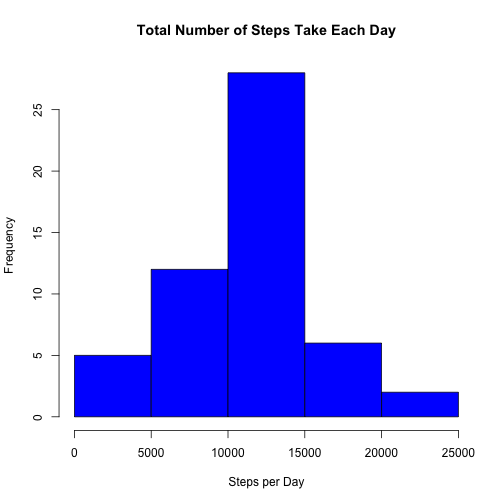
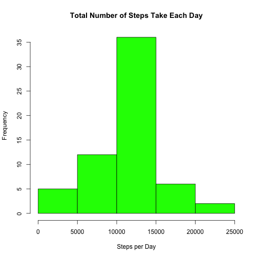
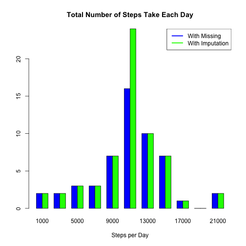
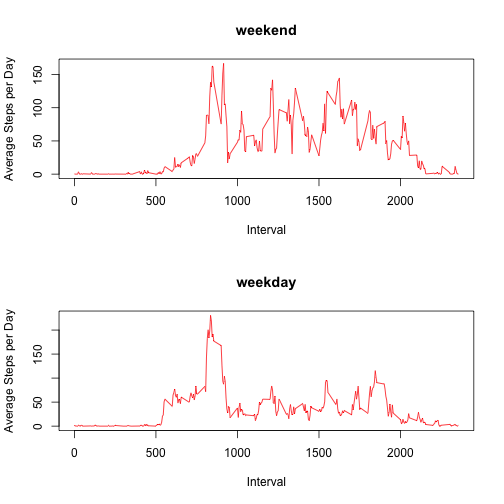

Reproducible Research Assignment 1
=================================================================================

##Introduction
This is the first assignment in the Reproducible Research course. The data is available on the course website. The dataset is related to Activity Monitoring. The three variables are:

    steps: Number of steps taking in a 5-minute interval 

    date: The date on which the measurement was taken in YYYY-MM-DD format

    interval: Identifier for the 5-minute interval in which measurement was taken

For this assignment, two additional packages were used:
knitr
plotrix

##Loading the Data
Download & Unzip the Activity file. Set your working directory.
Read the csv file. View the data.

```r
list.files()
```

```
## [1] "activity.csv"        "repassignment1.html" "repassignment1.md"  
## [4] "repassignment1.R"    "repassignment1.Rmd"
```

```r
activityData<-read.table("activity.csv", sep=",", header=TRUE)
head(activityData)
```

```
##   steps       date interval
## 1    NA 2012-10-01        0
## 2    NA 2012-10-01        5
## 3    NA 2012-10-01       10
## 4    NA 2012-10-01       15
## 5    NA 2012-10-01       20
## 6    NA 2012-10-01       25
```

```r
tail(activityData)
```

```
##       steps       date interval
## 17563    NA 2012-11-30     2330
## 17564    NA 2012-11-30     2335
## 17565    NA 2012-11-30     2340
## 17566    NA 2012-11-30     2345
## 17567    NA 2012-11-30     2350
## 17568    NA 2012-11-30     2355
```

Preprocess the data by subsetting the variables. 

```r
steps<-activityData[ ,1]
date<-activityData[ ,2]
interval<-activityData[ ,3]
```

##Mean Total Number of Steps Taken per Day
To calculate the mean per day, use tapply to calculate the steps taken per day. Use the mean and median function on this these sums to find the average & median steps taken per day. The histogram depicts the distribution of the average steps taken per day. The mean and median are very close and the distrution appears normal. Most steps are within the mean, and it is less common the further away you get from the mean in either direction.


```r
perday<-tapply(steps, INDEX=date, FUN=sum)
mean(perday, na.rm=TRUE)
```

```
## [1] 10766.19
```

```r
median(perday, na.rm=TRUE)
```

```
## [1] 10765
```

```r
hist(perday, xlab= "Steps per Day", col="blue", main="Total Number of Steps Take Each Day")
```

 

##Average Daily Activity Pattern
To calculate how the activity pattern changes over time, use aggregate to average the steps by the time interval. The maximum number of steps is 206.17 which occurs at interval 835.

```r
perinterval <- aggregate(steps ~ interval, data = activityData, FUN = mean)
plot(perinterval, type='l', xlab="Time Interval", ylab="Average Steps per Interval", main="Average Daily Activity Pattern")
```

 

```r
summary(perinterval)
```

```
##     interval          steps        
##  Min.   :   0.0   Min.   :  0.000  
##  1st Qu.: 588.8   1st Qu.:  2.486  
##  Median :1177.5   Median : 34.113  
##  Mean   :1177.5   Mean   : 37.383  
##  3rd Qu.:1766.2   3rd Qu.: 52.835  
##  Max.   :2355.0   Max.   :206.170
```

```r
perinterval$interval[which.max(perinterval$steps)]
```

```
## [1] 835
```

##Impute Missing Values
First, calculate the total number of missing values. 

```r
sum(is.na(activityData))
```

```
## [1] 2304
```
To fill in the missing values, the 5-minute interval average, as calculated above, will be used. In order to complete this, a new dataset will be created adding a column with the 5-minute-interval average. Next, this average will be imputed whenever there is a missing value.


```r
activity2 <- merge(activityData, perinterval, by = "interval")
head(activity2)
```

```
##   interval steps.x       date  steps.y
## 1        0      NA 2012-10-01 1.716981
## 2        0       0 2012-11-23 1.716981
## 3        0       0 2012-10-28 1.716981
## 4        0       0 2012-11-06 1.716981
## 5        0       0 2012-11-24 1.716981
## 6        0       0 2012-11-15 1.716981
```

```r
activity2$steps.x[is.na(activity2$steps.x)] <- activity2$steps.y[is.na(activity2$steps.x)]
head(activity2)
```

```
##   interval  steps.x       date  steps.y
## 1        0 1.716981 2012-10-01 1.716981
## 2        0 0.000000 2012-11-23 1.716981
## 3        0 0.000000 2012-10-28 1.716981
## 4        0 0.000000 2012-11-06 1.716981
## 5        0 0.000000 2012-11-24 1.716981
## 6        0 0.000000 2012-11-15 1.716981
```

As in the first section of the assignment, the average steps per day are calcuated but with the completed dataset. First, the columns are subsetted. Next, tapply is used to calculate the total number of steps per day. The mean and median function are used to calculate these measures of central tendency. A histogram is created to view the overall distribution.


```r
steps2<-activity2[ ,2]
date2<-activity2[ ,3]
interval2<-activity2[ ,1]

perday2<-tapply(steps2, INDEX=date2, FUN=sum)
mean(perday2)
```

```
## [1] 10766.19
```

```r
median(perday2)
```

```
## [1] 10766.19
```

```r
hist(perday2, xlab= "Steps per Day", col="green", main="Total Number of Steps Take Each Day")
```

 

To compare the original dataset to the imputed dataset, the Plotrix package was installed to create a multihistogram. 

```r
library(plotrix)
perdays<-list(perday, perday2)
multhist(perdays, xlab= "Steps per Day", col=c("blue","green"), main="Total Number of Steps Take Each Day")
legend("topright", c("With Missing","With Imputation"), lty=c(1,1), lwd=c(2.5,2.5), col=c("blue", "green"))
```

 

The mean and median are very similar for both datasets. This is due to the choice of imputation. The kurtosis of the distribution is affected by the imputation. There are a higher frequency of the average measure.


```r
mean(perday,na.rm=TRUE)
```

```
## [1] 10766.19
```

```r
mean(perday2)
```

```
## [1] 10766.19
```

```r
median(perday,na.rm=TRUE)
```

```
## [1] 10765
```

```r
median(perday2)
```

```
## [1] 10766.19
```

##Activity Patterns on Weekdays vs. Weekends
First, a column needs to be added that labels the date as either a weekday or a weekend. Using the weekdays() function allows for the day of the week to be labeled. If the day of the week is a Saturday or a Sunday it is labeled as a weekend, else it is labeled as a weekday. 


```r
dayofweek <- function(date) {
        if (weekdays(as.Date(date)) %in% c("Saturday", "Sunday")) {
                "weekend"
        } else {
                "weekday"
        }
}
activity2$dayofweek <- as.factor(sapply(activity2$date, dayofweek))
head(activity2)
```

```
##   interval  steps.x       date  steps.y dayofweek
## 1        0 1.716981 2012-10-01 1.716981   weekday
## 2        0 0.000000 2012-11-23 1.716981   weekday
## 3        0 0.000000 2012-10-28 1.716981   weekend
## 4        0 0.000000 2012-11-06 1.716981   weekday
## 5        0 0.000000 2012-11-24 1.716981   weekend
## 6        0 0.000000 2012-11-15 1.716981   weekday
```

A time series panel plot allows for the comparison between weekday activity versus weekend activity. Establish the space for the two graphs. Calculate the average number of steps per day, as before, but now by the day of week (weekday or weekend).


```r
par(mfrow = c(2, 1))
for (type in c("weekend", "weekday")) {
        stepsday <- aggregate(steps.x ~ interval, data = activity2, 
        subset = activity2$dayofweek == type, FUN = mean)
        plot(stepsday, type = "l", main = type,col=c("red"),xlab="Interval",
        ylab="Average Steps per Day")
}
```

 
The weekend appears to have more steps throughout the day but starting at a later interval with a slower incline (i.e. sleeping in and having more time to start the day). The weekdays start more steeply (i.e.needing to get ready more quickly for work obligations) and have one prominent peak activity time. Steps also slow down at an earlier interval (i.e. getting ready for bed earlier). 

##The End
Close your graphing device to resume regular single plots.

```r
dev.off()
```

```
## null device 
##           1
```

This concludes the assignment. 
